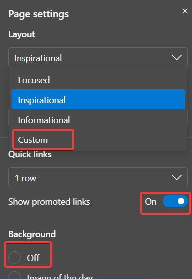
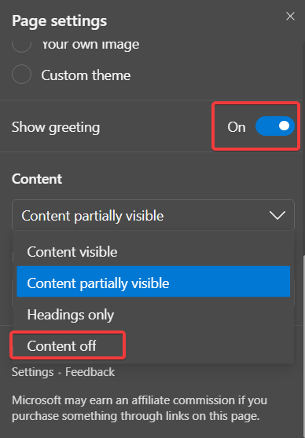
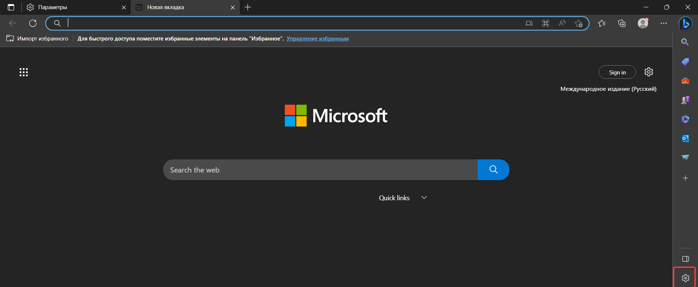
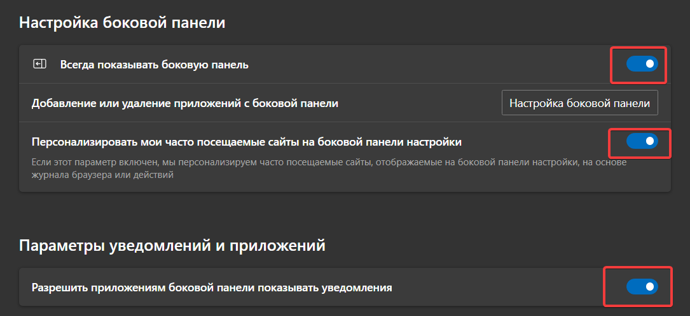
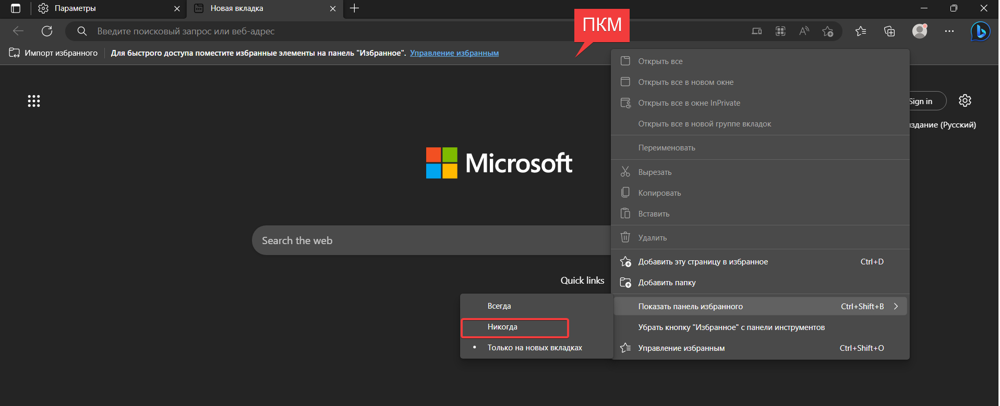

# Customizing-and-configuring-Edge-Tips-for-optimizing-your-browsing-experience

<h1>Настройка браузера Edge</h1>
<p>Этот репозиторий содержит инструкции по настройке браузера Edge для улучшения производительности, безопасности и удобства пользования.</p>

<h2>Глава 1: Минимализм и упрощение дизайна веб-страниц</h2>
<p>Данная глава описывает различные способы минимизации дизайна веб-страниц, чтобы сделать их более простыми и удобными для чтения и использования.</p>
 






<h2>Убираем значок Bing</h2>

<p>В новых версиях браузера Edge наконец-то появилась возможность отключить значок Bing на верхней панели.</p>

<p>Если вы используете более старую версию, но хотите убрать этот значок - просто следуйте инструкции:</p>
<p>• Откройте командную строку от имени Администратора;</p>
<p>• Примените команду:</p>

```
reg add HKLM\SOFTWARE\Policies\Microsoft\Edge /v HubsSidebarEnabled /d 0 /t REG_DWORD /f;
```

<p>• Откройте Edge, перейдите на страницу edge://policy и нажмите на "Повторно загрузить политики".</p>
<p>• Готово. Значок Bing не отображается. </p>

<p>Для возвращения значка применяем команду:</p> 

```
reg delete HKLM\SOFTWARE\Policies\Microsoft\Edge /v HubsSidebarEnabled /f.
```

<h2>Глава 2: Настройка раcширений и флагов браузера</h2>
<p>В этой главе описываются различные способы настройки расширений браузера и флагов, чтобы обеспечить наилучшую производительность и опыт использования для пользователей.</p>

`Флаги для браузера:`
<p>➜ Smooth scrolling</p>
<p>➜ Experimental QUIC protocol</p>
<p>➜ GPU rasterization</p>
<p>➜ Enable Smooth Scrolling for PDF</p>
<p>➜ Parallel downloading</p>
<p>➜ Override software rendering list</p>
<p>➜ Make Rounded Tabs feature available</p>
<p> </p>

``Только для Windows 11:``
<p>➜ Enable Windows 11 Acrylic effect in menus</p>
<p>➜ Windows Fluent scrollbars</p>

<p> </p>
<p> </p>

`Расширенияя для браузера:`
<p>uBlock Origin - Наконец-то, быстрый и эффективный блокировщик для браузеров </p>
<p>ClearURLs - Удаление элементов слежения из URL-адресов. </p>
<p>DuckDuckGo Privacy Essentials - Максимум конфиденциальности, минимум усилий </p>
<p>LocalCDN - Защищает от отслеживания через CDN (сети доставки контента), перенаправляя запросы в локальное хранилище. </p>
<p>Privacy Badger - автоматически учится блокировать невидимые трекеры.</p>
<p>The Great Suspender Original - Заставь свой браузер работать быстрее, приостанавливая неактивные вкладки </p>
<p>Buster: Captcha Solver for Humans - Больше вам не нужно проходить капчу, расширение всё сделает за вас </p>
<p>SponsorBlock - Пропускайте спонсорские вставки, просьбы подписаться и другое в видео на YouTube. </p>

`Готовые конфиги для расширений`

<p>В архиве находятся мои персональные настройки для трёх расширений.</p> 

`uBlock Origin:`
<p>• ПКМ по значку расширения > Параметры расширения;</p>
<p>• Во вкладке "Настройки" внизу находим пункт "Восстановить из файла";</p>
<p>• Применяем файл "my-ublock.txt".</p>

`SponsorBlock:`
<p>• ПКМ по значку расширения > Параметры расширения;</p>
<p>• Во вкладке "Бэкап/Восстановление" кликаем на "Загрузить из файла";</p>
<p>• Применяем файл "SponsorBlockConfig.json".</p>

`Audio Channel:`
<p>• Нажать на значок расширения;</p>
<p>• Нажать на "Limiter" и кликнуть на "Advanced";</p>
<p>• Выставить значения с картинки.</p>


<h2>Глава 3: Обеспечение безопасности и приватности пользователей</h2>
<p>Эта глава содержит инструкции по настройке браузера для обеспечения максимальной безопасности и приватности пользователей, включая настройку параметров конфиденциальности и защиту от вредоносных программ и хакерских атак.</p>

<p>Следуйте этим инструкциям, чтобы настроить свой браузер Edge наилучшим образом и обеспечить максимальный комфорт и защиту при использовании веб-серфинга.</p>
